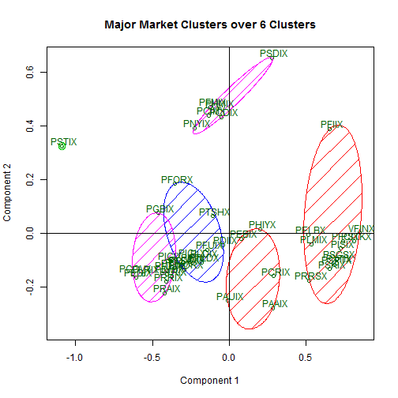

  
<style>
iframe{
  height:450px;
  width:900px;
  margin:auto auto;
}

body{
  font-family: 'Oxygen', sans-serif;
  font-size: 16px;
  line-height: 24px;
}

h1,h2,h3,h4 {
  font-family: 'Raleway', sans-serif;
}

.container { width: 900px; }

h3 {
  background-color: #D4DAEC;
    text-indent: 100px; 
}

h4 {
  text-indent: 100px;
}
</style>
  
<a href="https://github.com/timelyportfolio/rCharts_systematic_cluster"></a>

# Static and Interactive Plots of Principal Coordinates on Systematic Investor Clusters
I have already written it, but I feel the need to once again compliment [Systematic Investor](http://systematicinvestor.wordpress.com) for the very fine R financial work that he shares.  The only thing that I can think of to improve what he has done is by using [rCharts](http://rcharts.io) and [d3.js](http://d3js.org) to add interactivity to his plots.  In this quick example, we'll cluster some Pimco mutual fund price data and plot the Principal Coordinates with the orignal static graph and then use a couple lines of rCharts to demonstrate a [dimple.js](http://dimplejs.org) and a [nvd3](http://nvd3.org) version of the scatterplot.


### Gather Data as Usual

```r
# work with http://systematicinvestor.wordpress.com/category/cluster/
# visualize with d3 using rCharts

###############################################################################
# Load Systematic Investor Toolbox (SIT)
# http://systematicinvestor.wordpress.com/systematic-investor-toolbox/
###############################################################################
setInternet2(TRUE)
con = gzcon(url('http://www.systematicportfolio.com/sit.gz', 'rb'))
source(con)
close(con)
#*****************************************************************
# Load historical data for Pimco Funds
#****************************************************************** 
library(quantmod)
tickers = c("PISIX","PSKIX","PSDIX","PSTKX","PCRIX",
            "PFIIX","PHMIX","PFCIX","PCDIX","PTSHX",
            "PFMIX","PLMIX","PSPTX","PCIMX","PSTIX",
            "PNYIX","PLDTX","PLDIX","PTLDX","PAAIX",
            "PXTIX","PHIYX","PSCSX","PAUIX","PTRIX",
            "PGBIX","PFORX","PELBX","PDMIX","PMDRX",
            "PEBIX","PDIIX","PRRSX","PMBIX","PTSAX",
            "PTTRX","PIGLX","PRRIX","PFUIX","PIMIX",
            "PIGIX","PRAIX","PLRIX","PGOVX","PEDIX","VFINX")

data <- new.env()
getSymbols(tickers, src = 'yahoo', from = '1900-01-01', env = data, auto.assign = T)
for(i in ls(data)) data[[i]] = adjustOHLC(data[[i]], use.Adjusted=T)
#save(file="pimco_data.Rdata",list=ls(envir=data),envir=data)
```


### Copy/Paste Systematic Investor Calculations
I can't really add anything novel here, so I will basically copy and paste from some of Systematic Investor's posts and functions.  If I incorrectly changed Principal Components to Principal Coordinates, please let me know, but the way I understand it `cmdscale` returns Principal Coordinates.  Here is some [additional discussion from Cross Validated](http://stats.stackexchange.com/questions/14002/whats-the-difference-between-principal-components-analysis-and-multidimensional).


```r
bt.prep(data, align='remove.na')

# get the one period returns
ret <- data$prices / mlag(data$prices) - 1
# make first returns 0 instead of NA
ret[1,] <- 0

# create input assumptions
ia = create.historical.ia(ret, 252) 

# create clusters
grp = cluster.group.kmeans.90(ia)
ngroups = max(grp)

# since cluster.group.kmeans.90 only returns the group
# get the components out manually with these bits of code
correlation = cor(ret, use='complete.obs', method = "spearman")    
dissimilarity = 1 - (correlation)
distance = as.dist(dissimilarity)

# get principal coordinates
xy = cmdscale(distance)
fit = kmeans(xy, ngroups, iter.max=100, nstart=100)
```


### Pretty Pictures
This, of course, is my favorite part.  Drawing pictures adds a whole new level of understanding to data.  We'll first plot the original static graphic using `clusplot`.  There is certainly nothing wrong with this fine plot, but interactivity usually helps me understand and also gives me somthing to play with.


```r
require(cluster)
# do a noninteractive plot of the coordinates
clusplot(xy, fit$cluster, color=TRUE, shade=TRUE, labels=3, lines=0, plotchar=F, 
         main = paste('Major Market Clusters over 6 Clusters'), sub='')
abline(v=0)
abline(h=0)
```

 


[dimple.js](http://dimplejs.org) is generally the first rCharts library that I use when I first start drawing plots, since it is extremely flexible.  It does suffer just slightly though with a lack of pre-built interactive controls.


```r
# now use rCharts to get some interactive d3 plots
pc.df <- data.frame(rownames(xy),grp,-xy)
colnames(pc.df) <- c("symbol","group","PC1","PC2")

# first a dimplejs version
dP <- dPlot(
  PC2 ~ PC1,
  groups = c("symbol","group"),
  data = pc.df,
  type = "bubble"
)
dP$xAxis( type = "addMeasureAxis" )
dP
```

<iframe src=assets/fig/unnamed-chunk-5.html seamless></iframe>


[nvd3](http://nvd3.org) is a little slicker with its interactivity and styling.  Unfortunately though it suffers from a little issue with its tooltips on scatterplots.  The tooltips don't work until the magnify control is toggled on and then off.


```r
# then a nvd3 version
nP <- nPlot(
  PC2 ~ PC1,
  group = "group",
  data = pc.df,
  type = "scatterChart")
nP$xAxis(tickFormat = "#!d3.format('.2%')!#")
nP$yAxis(tickFormat = "#!d3.format('.2%')!#")
nP$chart(
  showDistX = TRUE,
  showDistY = TRUE,
  tooltipContent = "#!function(key, y, e, graph) {
    return '<h3>Group: ' + key + '<br>' +
      graph.point.symbol + '</a></h3>';
  }!#")
nP
```

<iframe src=assets/fig/unnamed-chunk-6.html seamless></iframe>


### Thanks
Thanks [Systematic Investor](http://systematicinvestor.wordpress.com), [Ramnath Vaidyanathan](http://github.com/ramnathv), [Mike Bostock](http://bost.ocks.org/mike/), and all the other fine people who have so generously shared their Javascript and R code.
